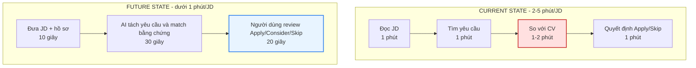

# 01 — Individual Problem Scan

> Điền theo Phase 1 + Phase 2 trong `01-worksheet.md`. Tự scan trước, dùng AI sau để phản biện. Không copy ví dụ Weekly Report.

## Thông tin cá nhân

- Họ và tên: Nguyễn Quốc Cường
- Mã học viên: 2A202602886
- Vai trò / bối cảnh (VD: sinh viên năm X, intern PM, ...): Sinh viên năm cuối
- Công việc hằng tuần (3-5 gạch đầu dòng để soi problem):
> *- Kiểm tra công việc được đăng trên các trang nhóm tuyển dụng.*
> *- Cập nhật tổng hợp thông tin từ các nguồn tin quan tâm, ví dụ liên quan như kiến thức, công việc, giải trí.*
> *- Học tập các kiến thức mới và tổng hợp ôn tập lại sau một khoảng thời gian nhất định*
---

## Phase 1 — Scan 5+ problems (tối thiểu 5, khuyến khích 8-10)

**Cách điền:** mỗi dòng = việc gì + ai chịu + đo bằng gì. Cột `Dấu hiệu thật` bắt buộc có số: mất bao lâu (bấm giờ mấy lần), mấy lần/tuần, bao nhiêu người gặp, log/ticket/quote nào.

| # | Lăng kính (Lặp lại / Tốn thời gian / AI có thể tốt hơn / Pain từ người khác) | Problem quan sát được | Ai chịu ảnh hưởng? | Dấu hiệu thật (số + bằng chứng) |
|---|---|---|---|---|
| 1 | Lặp lại, Tốn thời gian | Phải kiểm tra thủ công các tin tuyển dụng mới trên nhiều website và nhóm tuyển dụng | Sinh viên năm cuối, người tìm việc | Tầm 5 - 10 phút cho từng trang tuyển dụng |
| 2 | Tốn thời gian, AI có thể tốt hơn | Khó xác định nhanh tin tuyển dụng nào phù hợp với năng lực và định hướng cá nhân | Người tìm việc, đặc biệt là ứng viên fresher | Tầm 2-5 phút cho từng JD |
| 3 | Lặp lại, AI có thể tốt hơn | Phải điều chỉnh CV thủ công cho từng JD nhưng vẫn có thể bỏ sót yêu cầu quan trọng | Ứng viên | 15 - 30 phút cho từng JD |
| 4 | AI có thể tốt hơn | Khó xác định dự án nào nên đưa vào CV và trình bày trong phỏng vấn cho từng vị trí | Ứng viên có nhiều dự án | 15-20 phút điều chỉnh cân nhắc |
| 5 | Lặp lại, Tốn thời gian | Phải nhập lại thông tin cá nhân, học vấn, kỹ năng và kinh nghiệm trên nhiều form ứng tuyển | Ứng viên | 10 - 15 phút điền thông tin và kiểm tra |
| 6 | Lặp lại, Tốn thời gian | Khó theo dõi trạng thái của nhiều đơn ứng tuyển và thời điểm cần follow-up | Ứng viên | 1-2 phút cho việc kiểm tra trạng thái các đơn vị tuyển dụng |
| 7 | Tốn thời gian | Phải đọc nhiều nguồn tin về công nghệ, việc làm và giải trí nhưng phần lớn nội dung không thực sự liên quan | Sinh viên, người tự học | 2 - 10 phút cho từng nguồn thông tin |
| 8 | Lặp lại, Tốn thời gian | Kiến thức được lưu rải rác nên khó tìm lại khi cần học hoặc chuẩn bị phỏng vấn | Sinh viên, người tự học | 30 phút tìm kiếm sàng lọc |
| 9 | AI có thể tốt hơn | Sau khi học, người học chưa biết mình thực sự hiểu phần nào và đang hiểu sai ở đâu | Sinh viên, người tự học | 1-4 phút kiểm tra, đối chiếu cho từng vấn đề |
| 10 | Pain từ người khác, Lặp lại | Mentor phải góp ý lại những lỗi CV giống nhau như mô tả chung chung, thiếu số liệu và không sát JD | Mentor, career advisor, giảng viên hướng nghiệp | Không xác định, dự đoán 5 - 10 phút |

> Gợi ý tự soi: tuần trước mất nhiều thời gian nhất vào việc gì? Việc gì hay trì hoãn? Người khác hay hỏi lại câu gì? Workflow nào ai cũng biết là chậm?

**AI đã dùng ở Phase 1 (nếu có):**
- Prompt đã hỏi: *Tôi là sinh viên công nghệ thông tin năm cuối trong bối cảnh sắp tốt nghiệp chuẩn bị ra trường đang tìm kiếm cơ hội việc làm và liên tục cải thiện bản thân. Công việc hằng tuần gồm: Kiểm tra công việc được đăng trên các trang nhóm tuyển dụng. Cập nhật tổng hợp thông tin từ các nguồn tin quan tâm, ví dụ liên quan như kiến thức, công việc, giải trí. Học tập các kiến thức mới và tổng hợp ôn tập lại sau một khoảng thời gian nhất định Tôi đã nghĩ ra các vấn đề sau: 1. Kiểm tra các công việc được đăng trên các trang tuyển dụng 2. Điều chỉnh CV và ứng tuyển dựa theo yêu cầu tuyển dụng 3. Lướt qua các nguồn thông tin theo lĩnh vực mình quan tâm 4. Học tập rèn luyện các kiến thức mới 5. Ôn tập lại các kiến thức đã học tập trong 1 tuần Hãy gợi ý thêm problem theo 4 lăng kính: lặp lại, tốn thời gian, AI có thể tốt hơn, pain từ người khác. Với mỗi gợi ý, ghi actor, workflow sơ bộ và cách đo. Đừng đưa ý tưởng quá rộng kiểu "xây trợ lý AI toàn năng".*
- Ý dùng được: 4, 5, 9, 10
- Ý bỏ vì không phải pain thật: Interviewer khó xác định đóng góp thực tế của ứng viên trong các dự án nhóm.

**Self-check Phase 1:**
- [x] Đủ 5+ dòng, mỗi dòng có actor + số đo cụ thể
- [x] Dùng ít nhất 3/4 lăng kính
- [x] Không có dòng chung chung kiểu "mất nhiều thời gian"

---

## Phase 2 — Top 3 Problem Cards

### 2.1. Chọn top 3

Giữ bài nào: actor cụ thể, workflow vẽ được 3-7 bước, bottleneck ở 1 bước, impact đo được. Loại bài quá rộng.

| Rank | Problem (copy từ bảng scan) | Vì sao chọn (2-3 ý) | Điều còn chưa chắc |
|---|---|---|---|
| 1 | Điều chỉnh CV thủ công cho từng JD nhưng vẫn có thể bỏ sót yêu cầu quan trọng | Actor rõ ràng, có workflow, bottleneck cụ thể | Đủ điều kiện ứng tuyển hay không, có đủ time chỉnh cv không |
| 2 | Khó xác định nhanh tin tuyển dụng nào phù hợp với năng lực và định hướng cá nhân  | Rõ actor, rõ bottleneck | Tiêu chí như nào, mức độ ra sao |
| 3 | Kiến thức được lưu rải rác nên khó tìm lại khi cần học hoặc chuẩn bị phỏng vấn | Rõ ràng actor, bottleneck cụ thể | Chọn lọc đối chiếu kiến thức |

### 2.2. Problem Cards chi tiết (lặp lại cho cả 3 cards)

---

#### Problem Card #1 — Đánh giá độ phù hợp của JD

```text
Problem 1 câu: Sinh viên năm cuối mất 2-5 phút/JD để đối chiếu JD với kỹ năng cá nhân nhưng vẫn dễ đánh giá sai hoặc bỏ sót yêu cầu.

Actor: Sinh viên năm cuối, ứng viên fresher.

Thời điểm / bối cảnh: Khi ứng viên đọc nhiều JD và cần chọn nhanh JD nào nên ứng tuyển.

Current workflow 3-7 bước:
1. Mở và đọc toàn bộ JD.
2. Tìm yêu cầu về kinh nghiệm, kỹ năng và công nghệ.
3. Xác định điều kiện như địa điểm, hình thức làm việc, ngoại ngữ.
4. So sánh từng yêu cầu với CV và kinh nghiệm cá nhân.
5. Cân nhắc mức độ thiếu hụt.
6. Quyết định ứng tuyển hoặc bỏ qua.
7. Ghi lại JD nếu quyết định ứng tuyển.

Bottleneck: Ánh xạ yêu cầu trong JD với bằng chứng trong CV. Ví dụ JD yêu cầu "asynchronous processing" nhưng CV chỉ ghi RabbitMQ.

Impact: 20 JD/tuần có thể tốn 40-100 phút, chưa tính chỉnh CV và điền form. Có thể bỏ lỡ JD phù hợp hoặc ứng tuyển sai JD.

Success metric: Dưới 1 phút/JD; 100% kết luận có yêu cầu + bằng chứng; phát hiện 90% điều kiện loại trực tiếp; Apply/Consider/Skip khớp đánh giá người dùng hoặc mentor ít nhất 80%.

Non-AI alternative: Dùng spreadsheet/checklist về stack, kinh nghiệm, ngoại ngữ, điều kiện làm việc; chấm Match/Partial/No match.

AI hypothesis: AI tách must-have, nice-to-have, điều kiện loại trực tiếp rồi match với hồ sơ để đề xuất Apply/Consider/Skip. AI không suy diễn kỹ năng ngoài hồ sơ.

Quick gut:
[ ] No AI / process fix
[ ] Rule
[x] Workflow
[ ] Agent
[ ] Chưa biết
```

**Draft workflow Card #1** (ASCII / Mermaid / ảnh đính kèm):



Fallback: nếu AI thiếu bằng chứng thì hiển thị checklist để ứng viên tự đánh giá.

File đính kèm (nếu vẽ riêng): `01-individual-problem-scan-workflow-card-1.png`

---

#### Problem Card #2 — Điều chỉnh CV theo từng JD

```text
Problem 1 câu: Ứng viên mất 15-30 phút để chỉnh CV theo từng JD nhưng vẫn có thể bỏ sót yêu cầu hoặc viết nội dung thiếu bằng chứng.

Actor: Sinh viên năm cuối, ứng viên fresher; mentor hoặc người review CV.

Thời điểm / bối cảnh: Khi ứng viên có CV gốc và cần tùy chỉnh cho các vị trí khác nhau như Backend, Software Engineer, Tester hoặc Web Developer.

Current workflow 3-7 bước:
1. Đọc và phân tích yêu cầu trong JD.
2. Mở CV hiện tại.
3. Chọn kỹ năng và dự án phù hợp.
4. Loại bỏ hoặc rút gọn nội dung ít liên quan.
5. Viết lại summary và bullet của dự án.
6. Kiểm tra keyword, ngữ pháp và format.
7. Xuất CV và đọc lại trước khi nộp.

Bottleneck: Chọn đúng dự án/kỹ năng và viết lại bullet sát JD mà không bịa thêm kinh nghiệm.

Impact: 10 đơn ứng tuyển có thể tốn 150-300 phút. Riêng việc cân nhắc dự án có lúc mất 15-20 phút.

Success metric: Tạo CV dưới 10 phút; 100% đề xuất truy vết về CV/dữ liệu dự án; 0 kỹ năng hoặc thành tích bịa; ít nhất 60% bullet được chấp nhận hoặc chỉ sửa nhẹ.

Non-AI alternative: Tạo master CV dạng module: kỹ năng, bullet dự án, bảng kỹ năng -> dự án -> bằng chứng, template theo vai trò.

AI hypothesis: Với JD, master CV và dữ liệu dự án, AI có thể xếp hạng dự án, chọn bullet phù hợp và nháp CV sát JD. AI chỉ dùng bằng chứng đã có.

Quick gut:
[ ] No AI / process fix
[ ] Rule
[x] Workflow
[ ] Agent
[ ] Chưa biết
```

**Draft workflow Card #2:**

```mermaid
flowchart TB
    subgraph Current["CURRENT STATE - 15-30 phút/JD"]
        A1["Đọc JD"] --> A2["Mở CV hiện tại"]
        A2 --> A3["Chọn kỹ năng/dự án phù hợp"]
        A3 --> A4["Viết lại summary và bullet"]
        A4 --> A5["Kiểm tra và xuất CV"]
    end

    subgraph Future["FUTURE STATE - dưới 10 phút/JD"]
        B1["Nhập JD + master CV"] --> B2["AI gợi ý phần nên giữ/sửa"]
        B2 --> B3["Người dùng duyệt từng thay đổi"]
        B3 --> B4["Xuất CV"]
    end

    A3:::bottleneck
    B3:::human

    classDef bottleneck fill:#ffe0e0,stroke:#cc3333,stroke-width:2px;
    classDef human fill:#e8f4ff,stroke:#2f80ed,stroke-width:2px;
```



Fallback: nếu AI tạo claim không có nguồn thì bỏ claim đó và dùng lại bullet đã xác minh.

File đính kèm: `01-individual-problem-scan-workflow-card-2.png`

---

#### Problem Card #3 — Tìm lại kiến thức phục vụ ôn tập và phỏng vấn

```text
Problem 1 câu: Sinh viên lưu kiến thức rải rác nên có thể mất khoảng 30 phút để tìm lại nội dung khi ôn tập hoặc chuẩn bị phỏng vấn.

Actor: Sinh viên IT, người tự học; mentor hoặc thành viên học nhóm.

Thời điểm / bối cảnh: Khi người học nhớ đã từng học một nội dung nhưng không nhớ nó nằm ở ghi chú, PDF, bookmark, repo hay lịch sử chat.

Current workflow 3-7 bước:
1. Cố nhớ đã học nội dung ở đâu.
2. Tìm bằng từ khóa trong từng nguồn.
3. Mở nhiều kết quả có khả năng liên quan.
4. Đọc và loại bỏ kết quả không phù hợp.
5. Đối chiếu giữa các tài liệu.
6. Tự tổng hợp câu trả lời.
7. Lưu lại hoặc bắt đầu ôn tập.

Bottleneck: Tìm chéo nhiều nguồn khi không nhớ đúng từ khóa. Ví dụ cùng chủ đề Spring bean nhưng tài liệu dùng nhiều cụm khác nhau.

Impact: Có thể mất khoảng 30 phút để tìm và lọc. Cần đo thêm số lần không tìm được tài liệu, phải tìm lại trên Internet hoặc lưu trùng.

Success metric: Với 10-20 câu hỏi thực tế, giảm thời gian tìm từ 30 phút xuống dưới 5 phút; 80% truy vấn có tài liệu đúng trong top 3; 100% câu trả lời có nguồn; không trả lời chắc chắn khi thiếu bằng chứng.

Non-AI alternative: Gom tài liệu, chuẩn hóa tên file, phân loại theo chủ đề, gắn tag và dùng full-text search.

AI hypothesis: Nếu index 2-3 nguồn dữ liệu và kết hợp keyword + semantic search, người học có thể tìm lại kiến thức nhanh hơn dù không nhớ đúng từ khóa.

Quick gut:
[ ] No AI / process fix
[ ] Rule
[x] Workflow
[ ] Agent
[ ] Chưa biết
```

**Draft workflow Card #3:**

```mermaid
flowchart TB
    subgraph Current["CURRENT STATE - khoảng 30 phút"]
        A1["Cố nhớ nguồn"] --> A2["Tìm keyword trong từng nguồn"]
        A2 --> A3["Mở nhiều kết quả"]
        A3 --> A4["Lọc tài liệu đúng"]
        A4 --> A5["Tự tổng hợp câu trả lời"]
    end

    subgraph Future["FUTURE STATE - dưới 5 phút"]
        B1["Nhập câu hỏi"] --> B2["Hệ thống tìm đoạn liên quan trong dữ liệu cá nhân"]
        B2 --> B3["Người học kiểm tra nguồn và dùng để ôn tập"]
    end

    A2:::bottleneck
    A3:::bottleneck
    A4:::bottleneck
    B3:::human

    classDef bottleneck fill:#ffe0e0,stroke:#cc3333,stroke-width:2px;
    classDef human fill:#e8f4ff,stroke:#2f80ed,stroke-width:2px;
```



Fallback: nếu thiếu bằng chứng thì báo "không tìm thấy trong dữ liệu cá nhân", chỉ hiển thị kết quả gần nhất.

File đính kèm: `01-individual-problem-scan-workflow-card-3.png`

---

### 2.3. Card muốn pitch nhất (chuẩn bị 2 phút)

**Card tôi muốn pitch nhất:**

```text
Problem Card #2 - Điều chỉnh CV theo từng JD
```

**Vì sao (2-3 câu: workflow gì, số đo gì, impact gì):**

```text
Em muốn pitch card này vì workflow rõ: đọc JD, mở CV gốc, chọn kỹ năng/dự án, viết lại bullet, kiểm tra và xuất CV. Mỗi JD mất 15-30 phút; 10 đơn có thể mất 150-300 phút.

Impact chính là ứng viên tốn thời gian, dễ bỏ sót yêu cầu hoặc viết nội dung thiếu bằng chứng. Nếu giải quyết tốt, fresher có thể tạo CV sát JD nhanh hơn nhưng vẫn tự kiểm tra bản cuối.
```

**Câu hỏi tôi muốn nhóm challenge (1-2 câu hỏi đúng chỗ yếu):**

```text
Làm sao để AI chỉ được chọn và diễn đạt lại bằng chứng đã có trong master CV, không tự bịa thêm kỹ năng hoặc thành tích?

Success metric "60% bullet AI đề xuất được chấp nhận hoặc chỉ sửa nhẹ" đã đủ để chứng minh giá trị chưa, hay cần thêm metric như tỷ lệ JD requirements có bằng chứng tương ứng trong CV?
```

**AI phản biện Card (nếu có):**
- Điểm yếu AI chỉ ra: AI có thể viết CV vượt quá kinh nghiệm thật; master CV sơ sài thì khó truy vết bằng chứng.
- Tôi sửa gì: Giới hạn AI ở vai trò hỗ trợ workflow. Mỗi bullet phải có nguồn từ CV/dự án và người dùng duyệt trước khi xuất CV.

### Self-check nộp phần 01
- [x] Có 5+ problems + top 3 Cards đủ field
- [x] Mỗi Card có workflow trước/sau + bottleneck + metric + fallback
- [x] Đã chọn 1 card pitch + câu hỏi challenge
